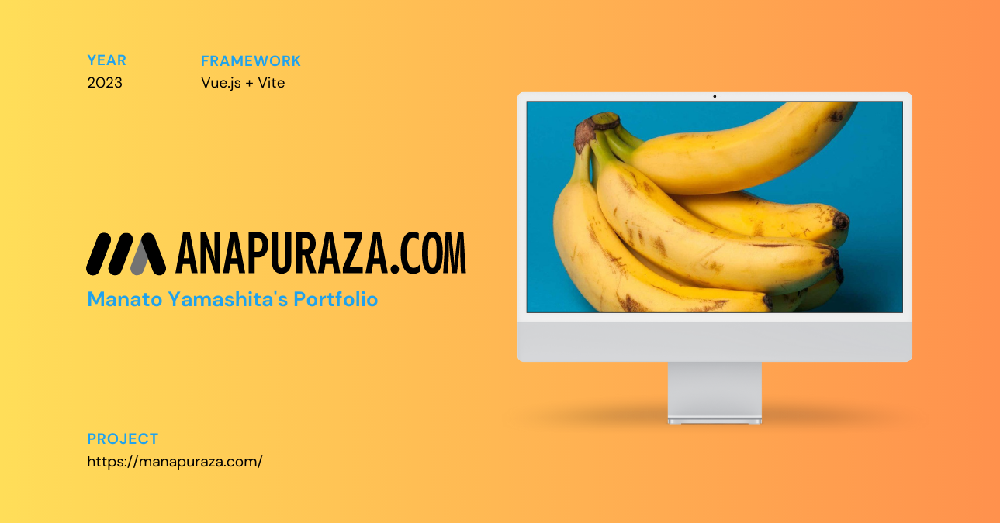

# MANAPURAZA.COM &#x1F34C;

* **ver1.0**: https://manapuraza-s0y8f8i94-manatoyamashita.vercel.app
* **ver2.0**: https://manapuraza.com/

Manato Yamashita's portfolio site 2023.
This template should help get you started developing with Vue 3 by Vite.
Blushed up in Puzzle inc Engineering intern 2023

## Home
* 山下マナトのポートフォリオサイトです。
* Glass morfismデザインパターンを取り入れました。
* `Vue3` build with `Vite`, `vue-router`, `Fontawesome`, `Three.js`, `vue-i18n` などの技術を使っています。
* はみ出た要素はスクロールできます。

## About
* 私についての概要と経歴を一通り書きました。

## Works
* イラスト、プログラミング、映像などの趣味で制作したデジタルコンテンツを一部紹介します。

## Contact
* 連絡はg2172117@tcu.ac.jpまで。

### 今後
今後は日本語と英語に切り替えるトグルスイッチを追加し、余裕があればダークモードにも対応したいです。
最終更新: 2023/08/28
