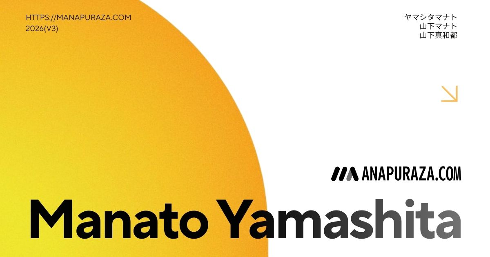
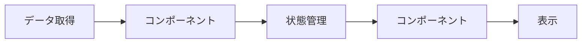
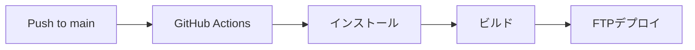

# MANAPURAZA.COM 🍌（山下マナト Webポートフォリオ）

  
  
  
  
  
  

## About

就活のための山下マナトWebポートフォリオサイト。東京都市大学の在学中（2021年 ~ 2024年）に制作したクリエイティブワークスをまとめています。
広告制作会社[株式会社パズル](https://puzzle-inc.jp)でのエンジニアインターン（2023年11月）を通じて、さらなる改善を重ねています。

### Deployment

- **最新版**: [manapuraza.com](https://manapuraza.com)
- **初期版**: [ver1.0](https://manapuraza-s0y8f8i94-manatoyamashita.vercel.app)

## Tech

- **Frontend**
  - Vue.js 3 (Composition API)
  - Vite
  - Vue Router
  - Vue I18n
  - Three.js
  - GSAP
  - Font Awesome

- **Deployment / Inflactractures**

  - GitHub Actions (CI/CD)
  - FTPサーバ（本番環境）
  - Vercel（デモ環境）

## Design

### Concept

- **Grassmorphism**: Apple製品からインスピレーションを得た現代的なUIデザイン, グラスモーフィズム
- **Color**:
  - メインカラー: イエロー/オレンジ（バナナをモチーフ）
  - アクセントカラー: 水色（補色による調和）
- **Responsive design**: モバイルファーストアプローチ

### UX/UI設計原則

- **直感的ナビゲーション**: ユーザーの探索をサポートする明確な情報階層
- **モバイル最適化**: 親指が届きやすい位置にメニューを配置
- **パフォーマンス**: 軽量なトランジションアニメーション

## Main functions

### Home

- インタラクティブな3Dバックグラウンド（Three.js）
- マウスインタラクションによるカメラアングル変更
- スムーズなアニメーション

### About

- 経歴/スキルの視覚的プレゼンテーション
経歴はオブジェクト形式で管理

### Creatives

- カテゴリー別ポートフォリオ表示
コンテンツは`data/creatives.json`で管理して取得しています。cmsの導入を検討中です。
  - アニメーション制作
  - グラフィックス/イラスト
  - プログラミング/Web開発
  - その他映像制作
- インタラクティブなホバーエフェクト
- オリジナルキャラクター「でじこんちゃん」のアニメーション

## 国際化対応

Vue i18nプラグインを用いて、サイトは以下の言語に対応しています：

- 🇯🇵 日本語
- 🇺🇸 英語

## Next Actions

- [ ] ダークモードの実装
- [ ] でじこんちゃんのインタラクション強化
- [ ] JAMstackベースのブログ機能
- [ ] パフォーマンス最適化（Lighthouseの結果にパフォーマンス項目に改善の余地あり）
- [ ] アクセシビリティの向上

## 🛠Process

### Data Flow

- Vueコンポーネントによる状態管理
- プロップスとイベントによる親子間通信
- Composition APIを活用した再利用可能なロジック

### パフォーマンス最適化

- 画像の遅延読み込み（`loading="lazy"`）
- 動的インポートによるコード分割
- アセットの最適化（WebP形式の使用）

### セキュリティ考慮事項

- クロスサイトスクリプティング（XSS）対策
- コンテンツセキュリティポリシー（CSP）の実装
- 適切なCORS設定

### CI/CD

### バージョン管理

- Node.js v18.17.0を使用
- npm v8.1.0を使用
- ESLint/Prettierによるコードフォーマット

### セキュリティ考慮事項

- クロスサイトスクリプティング（XSS）対策
- コンテンツセキュリティポリシー（CSP）の実装
- 適切なCORS設定

## ライセンス

© 2022~ Manato Yamashita. All Rights Reserved.

---
*最終更新: 2025/03/30*
