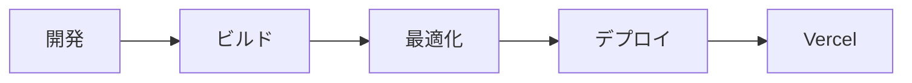

# MANAPURAZA.COM 🍌

  
  
  
  
  
  

## 🌟 プロジェクト概要

マルチメディアクリエイターとしての作品とスキルを展示するポートフォリオサイト。[株式会社パズル](https://puzzle-inc.jp)でのエンジニアインターン（2023年11月）を通じて、さらなる改善を重ねています。

### 🔗 デプロイ
- **最新版**: [manapuraza.com](https://manapuraza.com)
- **初期版**: [ver1.0](https://manapuraza-s0y8f8i94-manatoyamashita.vercel.app)

## 💻 技術スタック

- **フロントエンド**
  - Vue.js 3 (Composition API)
  - Vite
  - Vue Router
  - Vue I18n
  - Three.js
  - GSAP
  - Font Awesome

- **デプロイ/インフラ**
  - Vercel
  - GitHub Actions (CI/CD)

## 🎨 デザインフィロソフィー

### ビジュアルデザイン
- **グラスモーフィズム**: Apple製品からインスピレーションを得た現代的なUIデザイン
- **カラーパレット**:
  - メインカラー: イエロー/オレンジ（バナナをモチーフ）
  - アクセントカラー: 水色（補色による調和）
- **レスポンシブデザイン**: モバイルファーストアプローチ

### UX/UI設計原則
- **直感的ナビゲーション**: ユーザーの探索をサポートする明確な情報階層
- **モバイル最適化**: 親指が届きやすい位置にメニューを配置
- **パフォーマンス**: 軽量なトランジションアニメーション

## 📱 主要機能

### 🏠 ホーム
- インタラクティブな3Dバックグラウンド（Three.js）
- マウスインタラクションによるカメラアングル/カラー変更
- スムーズなオープニングアニメーション

### 👤 アバウト
- 経歴/スキルの視覚的プレゼンテーション
- インタラクティブな要素による没入型体験

### 💼 ワークス
- カテゴリー別ポートフォリオ表示
  - グラフィックス/イラスト
  - プログラミング/Web開発
  - 映像/アニメーション
- インタラクティブなホバーエフェクト
- オリジナルキャラクター「でじこんちゃん」のアニメーション

## 🚀 今後の展開

- [ ] ダークモードの実装
- [ ] でじこんちゃんのインタラクション強化
- [ ] JAMstackベースのブログ機能
- [ ] パフォーマンス最適化
- [ ] アクセシビリティの向上

## 📝 ライセンス
© 2024 Manato Yamashita. All Rights Reserved.

---
*最終更新: 2024/01/24*

### データフロー
- Vueコンポーネントによる状態管理
- プロップスとイベントによる親子間通信
- コンポジションAPIを活用した再利用可能なロジック

### パフォーマンス最適化
- 画像の遅延読み込み（`loading="lazy"`）
- 動的インポートによるコード分割
- アセットの最適化（WebP形式の使用）

### セキュリティ考慮事項
- クロスサイトスクリプティング（XSS）対策
- コンテンツセキュリティポリシー（CSP）の実装
- 適切なCORS設定

### デプロイメントフロー

### バージョン管理
- セマンティックバージョニングの採用
- 変更履歴の詳細な記録
- GitHub Actionsによる自動化されたデプロイ
